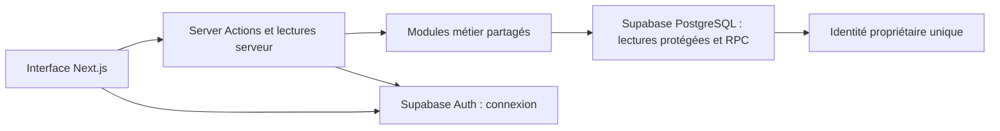
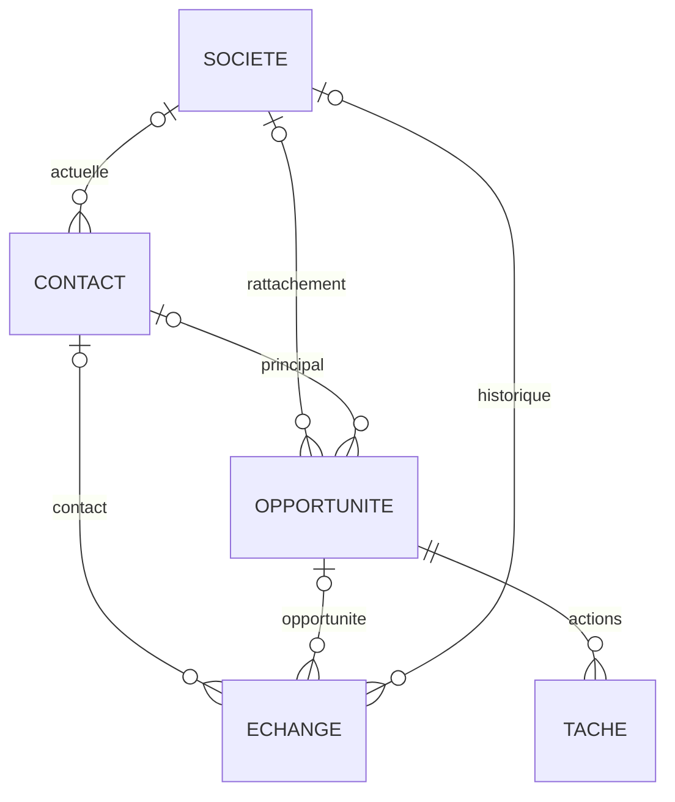

# Architecture du POC CRM

## Design Paradigm

**Monolithe modulaire en couches [ADOPTED]** : une application Next.js sur Vercel et un projet Supabase pour PostgreSQL et Auth. Modules métier : contacts, sociétés, opportunités, échanges et tâches. Accueil et Relances sont des lectures des mêmes données métier.

Les décisions validées et leurs corrections dans `reconcile-inputs.md` priment sur les propositions antérieures du PRD. Cette architecture a été validée par Lilian après sa revue ; aucun code applicatif ni service hébergé n’est encore réalisé.



## Invariants & Rules

### AD-1 — Propriétaire unique et isolation [ADOPTED]

- **Binds:** toutes les données ; FR-018.
- **Prevents:** l’accès d’un visiteur ou d’un autre compte Supabase aux données du CRM.
- **Rule:** le compte est créé à l’installation ; inscription publique désactivée. L’UUID propriétaire est enregistré dans une configuration privée, modifiable seulement par l’administration hors interface. Chaque lecture et commande serveur vérifie une session authentique et cet UUID. Chaque table métier exposée applique RLS pour ce même propriétaire ; les vues conservent la sécurité de l’appelant. La clé privilégiée n’est utilisée ni dans le navigateur ni dans les requêtes ordinaires. Aucun cache serveur partagé de données privées. Fin de session : purge des données et caches visibles ; récupération du mot de passe par Supabase Auth. La commande de déconnexion explicite reste une proposition d’interface Q5.

### AD-2 — Une voie commune pour les écritures [ADOPTED]

- **Binds:** contacts, sociétés, opportunités, échanges et tâches.
- **Prevents:** des règles différentes entre carte, panneau et liste, ou leur contournement via la Data API.
- **Rule:** l’interface utilise les Server Actions ; celles-ci vérifient session et schéma Zod avant d’appeler les commandes métier. Les mutations persistantes passent par des RPC PostgreSQL transactionnelles. `anon` et `authenticated` ne disposent pas de droits directs INSERT/UPDATE/DELETE sur les tables métier. Les RPC mutatrices utilisent `SECURITY DEFINER`, des noms SQL qualifiés et `search_path = ''`, vérifient explicitement le propriétaire issu de `auth.uid()` et valident leurs paramètres ; EXECUTE est retiré à PUBLIC/anon et accordé seulement au rôle authentifié pour les fonctions autorisées. Les fonctions internes ne sont pas exposées. Les lectures utilisent la session utilisateur et RLS. Les migrations SQL versionnées possèdent tables, fonctions, contraintes, droits et policies ; aucun schéma modifié seulement dans le dashboard. Si une intégration d’échanges est autorisée ultérieurement, son adaptateur réutilisera ces commandes et projections, notamment liens historiques et dernière interaction ; aucun connecteur n’est créé pour le POC.

### AD-3 — Concurrence et répétition d’une commande [ADOPTED]

- **Binds:** toutes les modifications ; décision validée sur les onglets concurrents.
- **Prevents:** l’écrasement silencieux et la création en double après une réponse réseau perdue.
- **Rule:** chaque entité mutable porte une révision globale pour son cache et des versions croissantes par champ modifiable. Une édition fournit les versions lues des seuls champs qu’elle remplace ; la RPC verrouille la ligne puis vérifie atomiquement ces versions avant écriture. Un champ ciblé modifié entre-temps retourne un conflit sans écriture ; un champ indépendant modifié dans un autre onglet n’est pas écrasé et ne bloque pas ce patch. Les versions des champs écrits et la révision globale augmentent dans la transaction. Les commandes composites vérifient aussi les versions des états dont elles dépendent. Le brouillon reste disponible ; un remplacement explicite fournit les nouvelles versions et est de nouveau contrôlé. Chaque commande reçoit une clé d’idempotence, conservée avec propriétaire, commande, empreinte et résultat dans la transaction ; un retry identique retourne le résultat enregistré, une réutilisation avec un autre contenu est refusée. Aucun effacement automatique de ces reçus pendant le POC.

### AD-4 — Opportunité et prochaine action atomiques [ADOPTED]

- **Binds:** FR-011 à FR-014 ; pipeline, panneau et relances.
- **Prevents:** deux tâches actives, une clôture partielle ou la réactivation implicite d’une ancienne tâche.
- **Rule:** cinq étapes fixes : À qualifier, Échange en cours, Proposition envoyée, Gagnée, Perdue ; création par défaut À qualifier. Une tâche a un intitulé, une date et un état à faire/terminée/annulée. Un index unique partiel sur l’opportunité pour l’état à faire garantit au plus une tâche active. Toute mutation de tâche ou d’étape verrouille d’abord l’opportunité, puis les tâches concernées dans un ordre stable. Clôture et choix conserver/annuler sont une seule transaction ; une action créée ou modifiée entre lecture et clôture invalide la commande, via une révision de workflow portée par l’opportunité et incrémentée à chaque mutation d’étape ou de tâche ; une modification de notes indépendante ne change pas cette révision de workflow. Abandon ne change rien. Réouverture ne réactive aucune tâche ; rétablissement d’une tâche terminée exige l’absence d’une autre tâche active, sans remplacement implicite.

### AD-5 — Données et historique commercial [ADOPTED]

- **Binds:** FR-001 à FR-010, FR-011 et FR-015.
- **Prevents:** des descriptions concurrentes, un changement d’employeur qui déplace l’historique, ou des montants incohérents entre vues.
- **Rule:** contact avec au moins un prénom ou nom, zéro ou une société actuelle et plusieurs opportunités possibles ; société avec nom obligatoire. Opportunité avec titre obligatoire, société et contact principal facultatifs et indépendants. Une seule colonne Notes est partagée par carte et panneau ; son édition ne crée pas d’échange. Un échange possède au moins un lien contact/opportunité et son propre lien société historique, prérempli depuis l’opportunité sinon le contact ; toute correction de ce lien est explicite. Les anciens échanges ne suivent pas un changement de société. Les dernières interactions se calculent depuis les échanges liés selon ces règles. Montant des opportunités gagnées = somme des montants renseignés des opportunités actuellement gagnées de la société ; compteur des montants absents séparé, absence distincte de zéro. Ces agrégats ne sont pas des champs modifiables. Les tables ne sont pas supprimées en cascade lors d’un changement de relation ; suppression métier reste un arbitrage, pas une commande ajoutée par défaut.

### AD-6 — Accueil et Relances distincts [ADOPTED]

- **Binds:** Accueil, FR-014, compteur des tâches et changement de jour.
- **Prevents:** la disparition d’une relance parce qu’elle n’entre pas dans les cinq priorités.
- **Rule:** Accueil sélectionne au plus cinq tâches à faire d’opportunités ouvertes : d’abord échues/du jour, par proximité de signature, puis prochaines dates disponibles. Les tâches Gagnée/Perdue sont exclues de cette sélection. Relances expose toutes les tâches à faire, toutes étapes, dans En retard/Aujourd’hui/À venir ; sa rubrique sans action porte seulement sur les opportunités ouvertes. Les filtres et limites Accueil ne sont jamais appliqués à Relances. Les rendez-vous restent dans l’agenda externe. Un service commun définit le jour Europe/Paris et les rubriques ; recalcul à minuit Paris et retour au premier plan. L’ordre commercial exhaustif et les départages attendent l’arbitrage indiqué dans le compagnon, avant les stories de classement.

### AD-7 — Réactivité sans faux enregistrement [ADOPTED]

- **Binds:** les quatre maquettes validées ; NFR-002 et objectif de saisie sous une minute.
- **Prevents:** un succès affiché malgré un refus serveur, la perte de saisie à reconnexion ou un panneau alimenté par des données périmées.
- **Rule:** édition en place du montant et des notes sur carte, sauvegarde déclenchée à la sortie du champ. États distincts : chargement, édition, enregistrement en cours, confirmé, échec/conflit. Un rendu optimiste n’est jamais une confirmation ; seul un commit serveur l’est. Erreurs et conflits conservent le brouillon. Brouillons par propriétaire/entité/champ dans sessionStorage, avec contenu, versions de base, identifiant de commande en cours et génération locale ; restaurés uniquement après reconnexion du même propriétaire. Une confirmation ne nettoie que les champs et la génération réellement enregistrés, jamais une saisie plus récente ; les écritures d’un même champ sont sérialisées côté client. Après reconnexion, la base de comparaison d’origine est conservée afin de détecter le conflit. Suppression du brouillon seulement après cette confirmation concordante ou abandon explicite ; aucun mot de passe ni jeton stocké dans ce mécanisme. Le panneau droit est piloté par l’état client et l’URL sans navigation serveur sur chaque clic ; son cache est isolé par propriétaire, entité et révision. Les mutations invalident aussi les listes, tâches et agrégats affectés ; réponses anciennes ignorées. Un mécanisme commun revalide le panneau, les listes et les agrégats au retour au premier plan, à la reconnexion et à la reprise réseau, sans remplacer les brouillons locaux ; aucun abonnement Realtime requis. Les lectures de listes gèrent explicitement la pagination et les compteurs globaux, sans troncature implicite par une limite API. Toutes les commandes essentielles ont un équivalent clavier au glisser-déposer. Les conventions de fluidité du projet s’appliquent dès le scaffold.

### AD-8 — Environnements et périmètre du POC [ADOPTED]

- **Binds:** développement, démonstration, déploiement et maintenance du schéma.
- **Prevents:** une démonstration qui modifie les données réelles ou le retour implicite des services écartés.
- **Rule:** développement local et aperçu Vercel utilisent exclusivement des données fictives ; ils ne ciblent jamais une base contenant des données réelles. Migrations reproductibles et seed fictif séparés ; ordre de livraison : appliquer des migrations compatibles avec le code déjà déployé, puis déployer le code consommateur, puis retirer les anciens contrats seulement lorsqu’ils ne sont plus utilisés. Une migration échouée bloque le déploiement dépendant ; seed jamais exécuté automatiquement sur une base réelle. Secrets serveur séparés des clés publiables, variables validées au démarrage. URLs Auth et redirections correspondent aux origines de test effectivement autorisées. Les logs contiennent identifiants techniques et erreurs, pas notes, coordonnées complètes ni tokens. Supabase et Vercel restent les deux services du POC ; pas de Neon, Better Auth, Prisma, API publique, connecteur commercial ou abonnement Realtime ajouté. NFR-005 retirée : aucune sauvegarde quotidienne ou rétention sept jours à mettre en place. Les plans, projet cible et paramètres e-mail se vérifient avant provisionnement, sans achat implicite.

## Consistency Conventions

| Concern | Convention |
| --- | --- |
| Identifiants | UUID générés côté base ; UUID Supabase Auth pour le propriétaire. |
| Montants | EUR HT facultatif ; stockage exact en centimes entiers, transport JSON en chaîne entière ; saisie décimale convertie sans flottant, au maximum deux décimales, aucune valeur négative ni arrondi silencieux. |
| Temps | Échéance SQL `date`, transport `YYYY-MM-DD` sans conversion en instant ; échanges et événements techniques horodatés UTC, rendu Europe/Paris. |
| Contrats | DTO et schémas Zod partagés par domaine ; types Supabase générés depuis migrations. Retours de commande : succès avec révision/données canoniques, ou validation/unauthenticated/forbidden/conflict/not_found/unavailable. |
| Réponses incertaines | Réessayer avec la même clé d’idempotence ; ne jamais créer une nouvelle commande pour obtenir la réponse de la précédente. |
| Propriété métier | Sociétés/contacts/opportunités/échanges/tâches possèdent chacun leurs données ; Accueil, Relances et totaux sont des projections. |

## Stack

Versions candidates vérifiées au 6 septembre 2026 ; sources et compatibilités déclarées dans `stack-evidence.md`. Le scaffold doit vérifier l’assemblage réel.

| Name | Version |
| --- | --- |
| Next.js App Router | 15.5.25 |
| React / React DOM | 19.2.8 |
| Node.js local / Vercel | 24.20.0 LTS / 24.x géré |
| @supabase/supabase-js | 2.115.0 |
| @supabase/ssr | 0.12.6 |
| Tailwind / @tailwindcss/postcss | 4.3.3 |
| CLI shadcn | 4.21.0, composants copiés à vérifier séparément |

Supabase PostgreSQL/Auth et Vercel sont gérés ; la version PostgreSQL sera relevée au provisionnement. Les autres dépendances seront épinglées selon les contraintes du socle lors du scaffold. Le starter officiel `with-supabase` est la référence d’intégration à adapter : conserver Next 15, convertir le proxy en middleware, passer Tailwind 3 à 4, retirer inscription publique et contenu de démonstration. Ne pas exécuter aveuglément ses dépendances `latest`.

## Structural Seed



La contrainte « contact ou opportunité, au moins un » sur Échange et l’unicité conditionnelle de tâche active sont des contraintes SQL, au-delà des cardinalités du diagramme.

```text
app/(auth)/                    connexion et récupération
app/(dashboard)/               accueil, contacts, sociétés, pipeline, relances
components/ui/                 primitives shadcn
components/crm/                shells, cartes, cellules et panneaux
lib/domain/                    contrats, requêtes et commandes par domaine
lib/validations/               schémas partagés
lib/supabase/                  session et adaptateur serveur
lib/ui/                        cache de panneaux et brouillons
supabase/migrations/           schéma, RPC, contraintes, droits et RLS
supabase/seed.sql               données fictives
```

Les versions du socle vérifiées et les adaptations du starter sont dans `stack-evidence.md`. Le code et le lockfile en deviennent la référence dès le scaffold ; la compatibilité de l’assemblage doit être vérifiée à ce moment.

## Capability → Architecture Map

| Capability / Area | Lives in | Governed by |
| --- | --- | --- |
| Contacts et Sociétés — FR-001 à FR-010 | Modules contacts/sociétés/échanges, panneaux et listes | AD-1/2/3/5/7 |
| Opportunités — FR-011/012 | Module opportunités, kanban et panneau | AD-1/2/3/4/5/7 |
| Actions et relances — FR-013/014 | Module tâches, projections Accueil/Relances | AD-1/2/3/4/6/7 |
| Échanges — FR-015 | Module échanges et projections de dernière interaction | AD-1/2/3/5 |
| Accès — FR-018 | Supabase Auth et session serveur | AD-1/7/8 |
| Démonstration et erreurs | Seed fictif, cas de recette | AD-3/4/7/8 |

## Deferred

Les arbitrages métier sont regroupés dans `arbitrages-restants.md`, avec le moment de reprise. Ils ne doivent pas être résolus différemment par chaque epic. L’infrastructure d’accès et les entités déjà décidées peuvent être préparées ; les stories dépendant d’un choix ouvert attendent son arbitrage. Le passage d’une démonstration à un usage réel et les plans d’hébergement ne sont pas autorisés par ce document. Archivage, scoring, intégrations, personnalisation et sauvegarde de secours restent hors périmètre.
